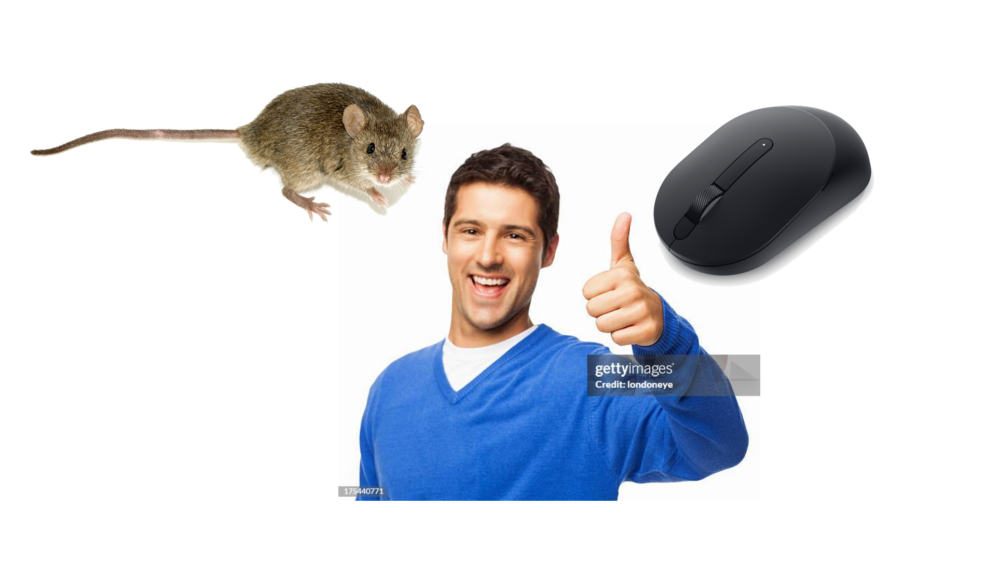

# AI-image-recognition
Group Programming Project - SQ4007

Team Avid C Haters

|name|student id| git hub username |
|--------------|-----------|--------|
| Morgan Lasky | 25198100 | mel14sky |
| Ben Smith | 25295700 | 18Smi |
| Abubaker Mahaoud | 25293400 | amahamoud177 |

[google doc](https://docs.google.com/document/d/1bYtS-HJQukRuRx0F0iE_WTJjWYI5F5ddWwFLTJYxAVo/edit?usp=sharing)

 ### demo from google
 - download the two mice files
 - go to the [google teachable machine](https://teachablemachine.withgoogle.com)
 - click get started
 - upload one folder to class 1
 - upload the other folder to class 2
 - click train model

This is you before using our tool
 
This is you after using our tool
 

